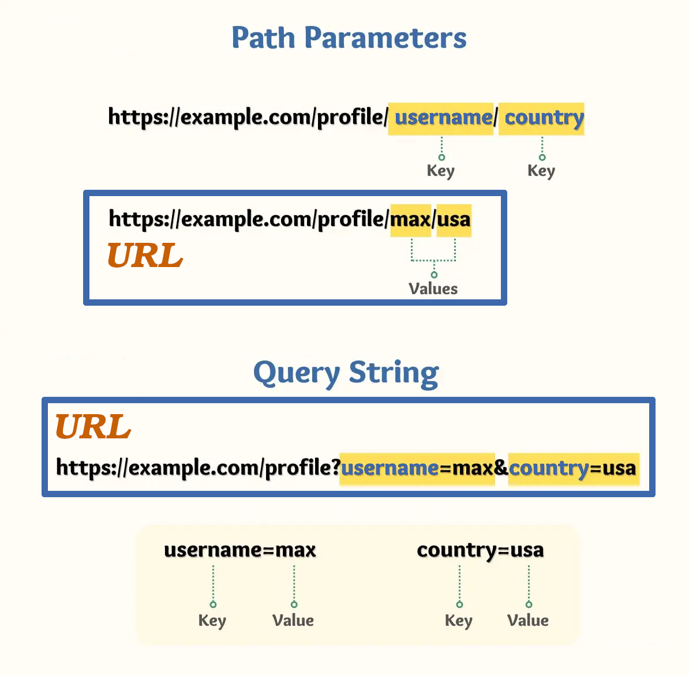
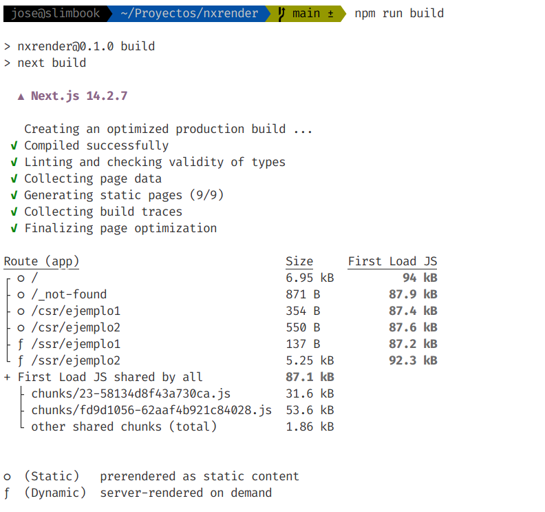

> DESARROLLO WEB EN ENTORNO SERVIDOR

# Tema 4: CONTENIDO DINÁMICO <!-- omit in toc -->
> Desarrollo de aplicaciones Web utilizando código embebido  
> PARAMS, SEARCHPARAMS, COOKIES

**[`PROYECTOS DE EJEMPLO`](PROYECTOS.md)**


---

- [1. Introducción](#1-introducción)
- [2. Parámetros de URL](#2-parámetros-de-url)
  - [2.1. Parámetros de ruta vs Parámetros de consulta.](#21-parámetros-de-ruta-vs-parámetros-de-consulta)
- [3. Funciones dinámicas](#3-funciones-dinámicas)
- [4. Renderizado en el Servidor vs Renderizado en el Cliente](#4-renderizado-en-el-servidor-vs-renderizado-en-el-cliente)
- [5. Cookies](#5-cookies)
  - [5.1. Tipos de cookies](#51-tipos-de-cookies)
  - [5.2. Generar Cookies](#52-generar-cookies)
  - [5.3. Leer Cookies](#53-leer-cookies)
  - [5.4. Eliminar Cookies](#54-eliminar-cookies)
- [6. ANEXO: Parámetros de ruta y consulta en página de cliente](#6-anexo-parámetros-de-ruta-y-consulta-en-página-de-cliente)
- [7. Referencias](#7-referencias)


--- 


# 1. Introducción

# 2. Parámetros de URL


Los parámetros de URL o **`URL Parameters`** son partes de la URL en las cuales los valores que aparecen pueden variar de una petición a otra, aunque la estructura de la URL se mantiene.

En las páginas gestionadas por el `app router` también podemos acceder a los 2 tipos que existen:

- **Parámetros de ruta** `Path Parameters`
- **Parámetros de consulta** `Query Parameters` o `Query Strings` 


Si tenemos la siguiente URL:

**`http://localhost:3000/products/bristol/books?sort=author&skip=1`**


Y el siguiente código en `src/app/products/[store]/[category]/page.js`


```js
export default function page({ params, searchParams }) {

    console.log( params.store )
    console.log( params.category )
    console.log( searchParams.sort )
    console.log( searchParams.skip )

    // ...
}
```

Producirá la siguiente salida:

```
bristol
books
author
1
``` 

En este caso tenemos:

- **Parámetros de ruta**: `store`, `category`
- **Parámetros de consulta**: `sort`, `skip`


## 2.1. Parámetros de ruta vs Parámetros de consulta.

Los parámetros de ruta y los parámetros de consulta transportan información al servidor a través de la URL. Ambos se utilizan para el mismo propósito. Pero tienen algunas diferencias.

- Los parámetros de ruta, debes colocarlos individualmente dentro de la ruta y son obligatorios.
- Sólo puedes indicar los parámetros de ruta especificados en la URL y en el mismo orden estipulado.
- Los parámetros de consulta no modifican la ruta, debes agregarlos al final de la URL y son opcionales. 
- Puedes indicar tantos parámetros de consulta, y en el orden que quieras, después de la ruta.


Es posible expresar una URL dinámica tanto de una forma como de la otra.




Aunque, a la hora de decidir si usar parámetros de ruta o parámetros de consulta, se siguen los siguientes convenios:

- Los parámetros de ruta nos proporcionan una URL más limpia.
- **Usamos parámetros de ruta si dicha información debe ir siempre en la URL.**
- **Usamos parámetros de consulta si dicha información es opcional, como información de filtrado o búsqueda.**


# 3. Funciones dinámicas


Las funciones dinámicas se basan en información que sólo se puede conocer en el momento de la solicitud, como las cookies del usuario, los encabezados de las solicitudes actuales o los parámetros de ruta y consulta de la URL. En Next.js, estas funciones dinámicas son:

- `params` (**parámetros de ruta**): El uso de esta propiedad en las `props` de una página habilitará la página para el renderizado dinámico en el momento de la solicitud. Aunque existe la posibilidad de generar el contenido de forma estática durante el despliegue realizando SSG.
- `searchParams` (**parámetros de consulta**): El uso de esta propiedad en las `props` de una página habilitará la página para el renderizado dinámico en el momento de la solicitud.
- `useSearchParams()` (**parámetros de consulta**): En componentes del cliente, el uso de esta función omitirá la renderización estática y en su lugar se realizará renderizado en el cliente (`CSR: Client Side Rendering`) de todos los componentes del cliente hasta el *Suspense* padre más cercano. Recomendamos envolver el componente del cliente que utilice useSearchParams() en un <Suspense/>. Esto permitirá que cualquier componente del cliente que se encuentre encima se renderice estáticamente. 
- `cookies()` y `headers()`: al usarlos en un componente de servidor optará por toda la ruta hacia el renderizado dinámico en el momento de la solicitud.

**Ejemplo:**

```javascript
// src/app/blog/[slug]/page.tsx
interface Props {
  params: { slug: string }
  searchParams: { [key: string]: string | string[] | undefined }
}

// params: Parámetros de ruta
// searchParams: Párametros de consulta
function Page({params, searchParams}: Props) {
  return <h1>My Page</h1>
}

export default Page
```

El uso de cualquiera de estas funciones optará por toda la ruta hacia la representación dinámica en el momento de la solicitud.

**Referencias:**

- https://nextjs.org/docs/app/building-your-application/rendering/server-components
- https://nextjs.org/docs/app/api-reference/file-conventions/page
- https://nextjs.org/docs/app/api-reference/functions/use-params
- https://nextjs.org/docs/app/api-reference/functions/use-search-params
 


> **NOTA:**
>
> NextJS, por defecto, hace *build* a contenido estático. El contenido dinámico requiere de renderizado en el lado servidor, lo cual ralentiza la respuesta al usuario. Si deseamos que el contenido de una página sea dinámico deberemos indicarlo con el siguiente código. 
>
>
>```js
>export const dynamic = 'force-dynamic'
>```


# 4. Renderizado en el Servidor vs Renderizado en el Cliente

El renderizado es la **representación gráfica del contenido de una página**, es decir, el proceso necesario para mostrar una página web en un navegador.

Existen 2 tipos de renderizado:

1. Client-Side Rendering (CSR) 
2. Server-Side Rendering (SSR)

NextJS soporta ambos tipos de renderizado, aunque recomienda usar SSR siempre que se pueda. Podemos entender SSR como sinónimo de generación en el lado servidor de contenido dinámico.

Para indicar a NextJS que una página o componente será renderizado en el lado cliente debemos colocar la primera línea del archivo con el siguiente texto.

```js
'use client'
```

**Ejemplo práctico**

A continuación tienes el código fuente para trabajar los conceptos anteriores.

- [Static vs Dynamic / CSR vs SSR](https://github.com/jamj2000/nxrender)

Para realizar ***build*** ejecutamos: 

```sh
npm  run  build
```



Para lanzar: 

```sh
npm  run  start
```

Diferencias entre SSR y CSR

SSR                                             | CSR
------------------------------------------------|---------------------------------
SSR significa Renderizado del lado del servidor | CSR significa Renderizado del lado del cliente
Representa la página en el lado del servidor    | Representa la página en el lado del cliente
Es más amigable con el SEO                      | Es menos compatible con SEO
La interactividad del usuario es limitada       | La interactividad del usuario es altamente interactiva
Consume los recursos del servidor               | Consume los recursos del cliente
Ofrece un mejor rendimiento en dispositivos de baja potencia | Es posible que no ofrezca un mejor rendimiento en dispositivos de baja potencia
Es posible que se requieran más recursos del servidor para manejar las tareas de renderizado | No requiere más recursos del servidor para manejar las tareas de renderizado


  


# 5. Cookies

Una cookie es un fichero de datos que una página web le envía a tu ordenador o móvil cuando la visitas. 

Las cookies suelen utilizarse principalmente para dos finalidades principales: **recordar accesos** y **conocer hábitos de navegación**. Las cookies hacen que las páginas web puedan identificar tu ordenador, y por lo tanto, si vuelves a entrar a ellas podrán recordar quién eres y qué has hecho antes dentro de ellas.

Gracias a las cookies la página web podrá recordar que eres tú, y por lo tanto podrá permitirte seguir en el perfil con el que iniciases sesión sin tener que volver a escribir tus credenciales.

Y no sólo para iniciar sesión. Imagínate que entras en Amazon y colocas muchos archivos en tu cesta de la compra sin tener una cuenta, pero luego te vas. Entonces, cuando vuelvas a entrar, gracias a tu IP y los otros identificadores que miran las cookies, Amazon sabrá quién eres y qué hiciste antes, y muy posiblemente todavía podrá recordar lo que tenías en la cesta de la compra para que no tengas que volver a meterlo.

## 5.1. Tipos de cookies

- **Cookies persistentes**: pueden llegar a almacenarse en el dispositivo del cliente durante meses o años. A menudo, la única manera de impedirlo es haciendo un borrado manual. Es importante que lo hagas sobre todo cuando uses un ordenador público. 
- **Cookies de sesión**: siempre se borran cuando finalizas la sesión en un sitio de Internet. Lo normal es que esto suceda de forma automática cuando cierras el navegador. También existe la posibilidad de indicar un tiempo de expiración usando la propiedad `expires`, o usando la propiedad `maxAge`. 

> **NOTA:** A partir de NextJS 15, el manejo de cookies se realiza de forma asíncrona. Por tanto deberemos usar `await cookies()

A continuación se muestra como trabjar con cookies desde NextJS.

## 5.2. Generar Cookies 

**`const cookieStore = await cookies()`**
**`cookieStore.set(name, value, options)`**

> **IMPORTANTE:** 
>
> Sólo es posible generar cookies en un `Server Action` o un `Route Handler`.
> HTTP no permite generar cookies después del comienzo de la respuesta.

```javascript
import { cookies } from 'next/headers'

const oneDay = 1000 * 60 * 60 * 24  // ms

async function setCookie( name ) {
  const cookieStore = await cookies()

  // Ejemplos
  cookieStore.set( name, 'jose')
  cookieStore.set( name, 'jose', { secure: true })
  cookieStore.set({
    name: name,
    value: 'jose', 
    httpOnly: true,
    path: '/',
    expires: Date.now() + oneDay 
    })
  cookieStore.set(name, JSON.stringify({ id: 1, user: "Pepe", loginDate: new Date() }))
}
```
> **NOTA:** Para crear una cookie de sesión debes omitir la opción `expires`. 
> 

```javascript
import { cookies } from 'next/headers'

export async function getCookie(name) {
    const cookieStore = await cookies()

    // Leemos cookie
    const cookie = cookieStore.get( name )?.value

    return cookie
}
```

## 5.3. Leer Cookies 

**cookies().get(name)**

```javascript
import { cookies } from 'next/headers'
 
export default function Page() {
  const usuario = cookies().get('usuario')

  return '<h1>Bienvendio {usuario}</h1>'
}
```


## 5.4. Eliminar Cookies

**cookies().delete(name)**

> **IMPORTANTE:** 
>
> Sólo es posible eliminar cookies en un `Server Action` o un `Route Handler`.

```javascript
'use server'
 
import { cookies } from 'next/headers'
 
async function deleteCookie() {
  cookies().delete('usuario')
}
```

> **NOTA:**
>
> Otra forma de eliminar una cookie es:
> 
> ```js
>  cookies().set("usuario", "", { expires: new Date(0) }); 
>```

    
Referencias: 

- [Documentación de NextJS](https://nextjs.org/docs/app/api-reference/functions/cookies)
- [Guía con ejemplos reales](https://blog.logrocket.com/guide-cookies-next-js/)


# 6. ANEXO: Parámetros de ruta y consulta en página de cliente

También es posible obtener los parámetros de ruta y los de consulta en el lado cliente. Para ello deberemos usar los hooks **`useParams`** y **`useSearchParams`**. También disponemos del hook `usePathname`, que nos devuelve la ruta (incluyento los parámetros de ruta, si existen) 

Por ejemplo, si tenemos la página `src/app/product/[name]/page.js` con el siguiente código:

```js
'use client'
import { usePathname, useParams, useSearchParams } from 'next/navigation';

const page = () => {
  const pathname = usePathname();
  const { name } = useParams();
  const searchParams = useSearchParams();

  const provider = searchParams.get('provider');
  const screen = searchParams.get('screen');

  return (
    <>
      <p> Ruta: {pathname} </p>
      <p> Parámetro de ruta: name -&gt; {name} </p>
      <p> Parámetro de consulta: provider -&gt; {provider} </p>
      <p> Parámetro de consulta: screen -&gt; {screen}  </p>
    </>
  )
};

export default page
```

y el usuario visita la URL `http://localhost:3000/product/laptop?provider=HP&screen=15`, entonces obtendrá el siguiente resultado

```
Ruta: /product/laptop
Parámetro de ruta: name -> laptop
Parámetro de consulta: provider -> HP
Parámetro de consulta: screen -> 15
```


# 7. Referencias

- [Listado de APIs públicas](https://publicapis.dev)

