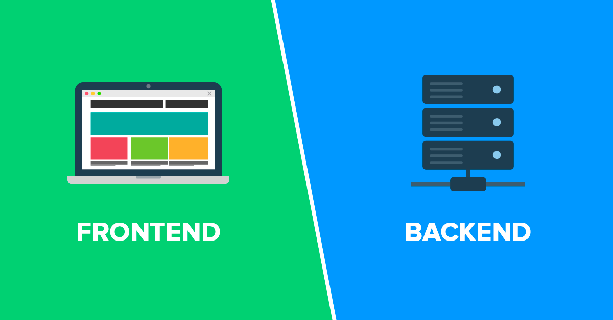
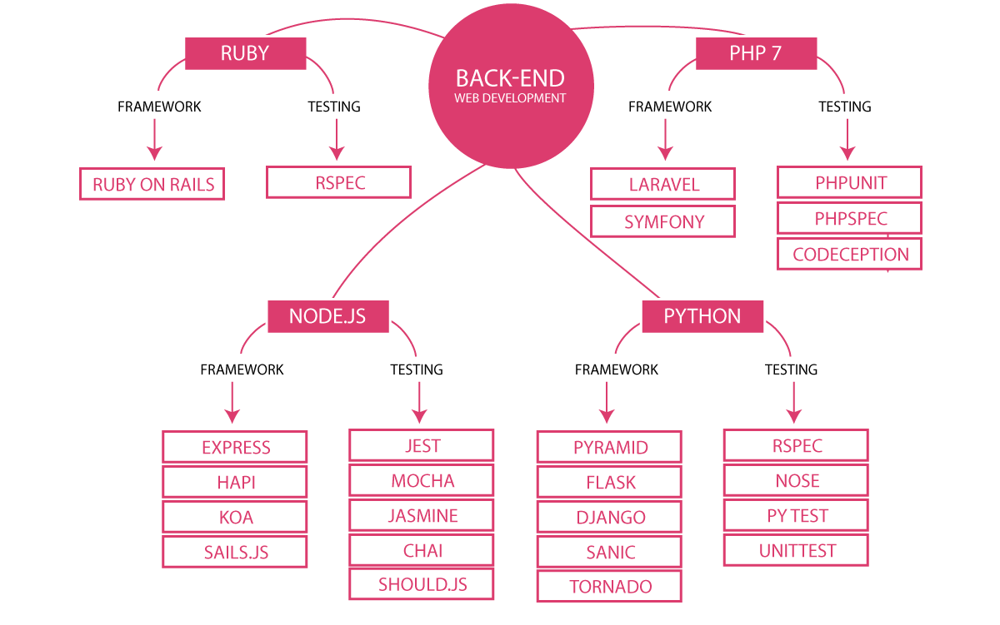
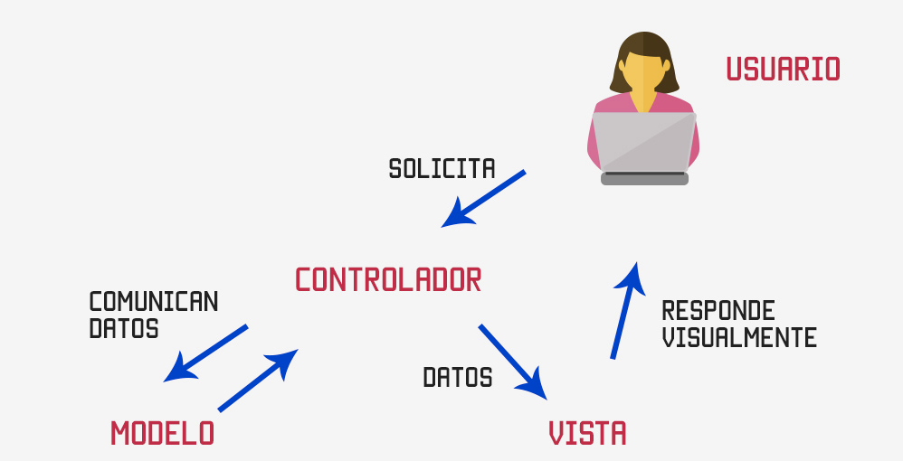
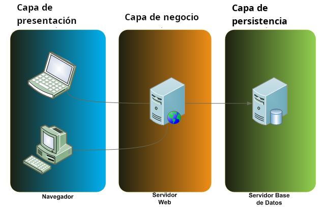
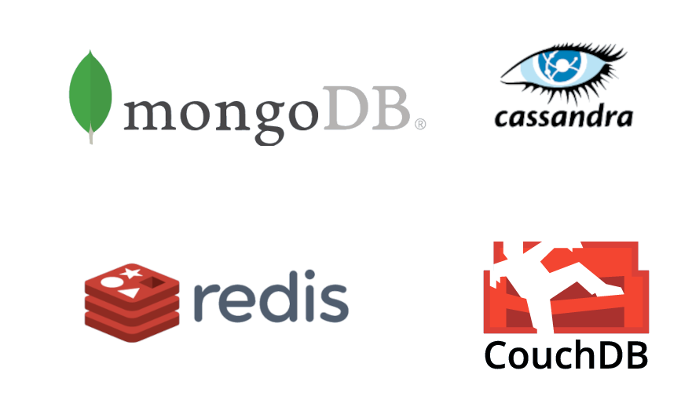
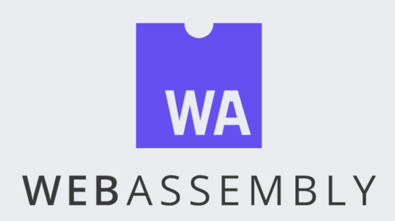

> DESARROLLO WEB EN ENTORNO SERVIDOR

# Tema 1: Selección de arquitecturas y herramientas de programación

## Contenido

- Introducción
- Tecnologías para el backend
- Tecnologías para el frontend
- Tecnologías javascript Fullstack
- MVC o SPA 
- Persistencia de los datos

--- 

## Introducción

### En esta Unidad aprenderemos a

- Identificar las tecnologías base de la web.
- Identfificar los lenguajes y frameworks usados en el lado del servidor.
- Identfificar los lenguajes y frameworks usados en el lado del cliente.
- Reconocer el patrón MVC.
- Distinguir entre MPA y SPA.
- Valorar la importancia de la persistencia de los datos.

### La base de la web

- **HTML**: Estructura del documento. `HTML5`. `2014`
- **CSS**: Formato/apariencia del documento. `CSS3`. 
- **Javascript**: Funcionalidad del documento. `ECMAScript6`. `2015`

Note: Al final de línea se muestra la versión más relevante actualmente y el año de su aparición oficial.

### Partes de una aplicación web

### Partes de una aplicación web

- **Backend**: parte que se ejecuta en el servidor.
  - Se encarga de atender las peticiones de los clientes.
  - Suele tener soporte de almacenamiento de datos.
  - También se denomina capa de acceso a datos
- **Frontend**: parte que se ejecuta en el cliente.
  - Se encarga de la experiencia del usuario (UX).
  - Puede tener soporte de cache de datos.
  - También se denomina capa de presentación.

## Tecnologías para el backend

### Lenguajes del lado del servidor

### Lenguajes del lado del servidor

- **PHP**: PHP Hypertext Preprocessor. Uno de los lenguajes más utilizados para la creación de todo tipo de CMS.
- **JSP**: JavaServer Pages. Es la propuesta de Java, y uno de los más demandados.
- **ASP**: Active Server Pages. Es el lenguaje de desarrollo web de Microsoft. 
- **Ruby**: es un lenguaje de programación interpretado, reflexivo y orientado a objetos.
- **Python**: es un lenguaje de programación multiparadigma que hace hincapié en el código legible. 
- **Javascript (Node.js)**: cada vez más popular puesto que se usa también en el lado cliente.

### Frameworks del lado servidor 

### Frameworks del lado servidor 

- PHP: **Laravel**, **Symfony**.
- JSP, Java: **Spring**.
- ASP: **ASP.NET**, **ASP.NET Core**.
- Ruby: **Ruby on rails**.
- Python: **Django**.
- Node.js: **Express**. 

### Resumen

## Tecnologías para el frontend

### Lenguajes del lado del cliente

### Frameworks del lado cliente 

- **Angular**
- **React**
- **Vue**
- **Svelte** (compilador)

### Resumen

## Tecnologías javascript Fullstack

### Frameworks para servidor y cliente 

- **Universal**
- **Next**
- **Nuxt**
- **SvelteKit**

## MVC o SPA

### Modelo-Vista-Controlador

### Modelo-Vista-Controlador

- patrón de diseño arquitectónico
- se ejecuta casi toda la lógica de aplicación en el backend. 
- el servidor sirve múltiples vistas, cada vista es una página HTML. 
- es una aplicación de múltiples páginas (MPA). 

https://es.wikipedia.org/wiki/Modelo%E2%80%93vista%E2%80%93controlador 

### Single Page Application

### Single Page Application

- se ejecuta gran parte de la lógica de la aplicación en el frontend. 
- el servidor sirve datos mediante una API web. 
- principalmente se usan 2 formatos para el intercambio de datos:
  - **XML**
  - **JSON** 

### MVC vs SPA

### Arquitectura de 3 capas

## Persistencia de los datos

- Uso de archivos
- Bases de datos relacionales
  - Subtipo importante: **BBDD objeto-relacionales**.
- Bases de datos no relacionales
  - Subtipo importante: **BBDD noSQL**.

### Bases de datos relacionales

### Bases de datos no relacionales (noSQL)

## Viajando al futuro, que ya es presente

- [WebAssembly](https://es.wikipedia.org/wiki/WebAssembly)

### WebAssembly (Wasm)

- Formato binario pequeño y rápido que promete un rendimiento casi nativo para las aplicaciones web.
- Los principales navegadores son compatibles con WebAssembly.
- Los desarrolladores escriben en el lenguaje de su elección (C, C++, ...), que luego se compila en bytecode WebAssembly.
- Para casos de uso intensivo de rendimiento, como juegos, transmisión de música, edición de vídeo y aplicaciones CAD.

### WebAssembly (Wasm)

- [WebAssembly explicado](https://www.ciospain.es/liderazgo--gestion-ti/que-es-webassembly-la-plataforma-web-de-proxima-generacion-explicada)

### Apps en Wasm

- [Algunas aplicaciones desarrolladas para WebAssembly](https://www.campusmvp.es/recursos/post/8-proyectos-espectaculares-que-utilizan-webassembly.aspx)
