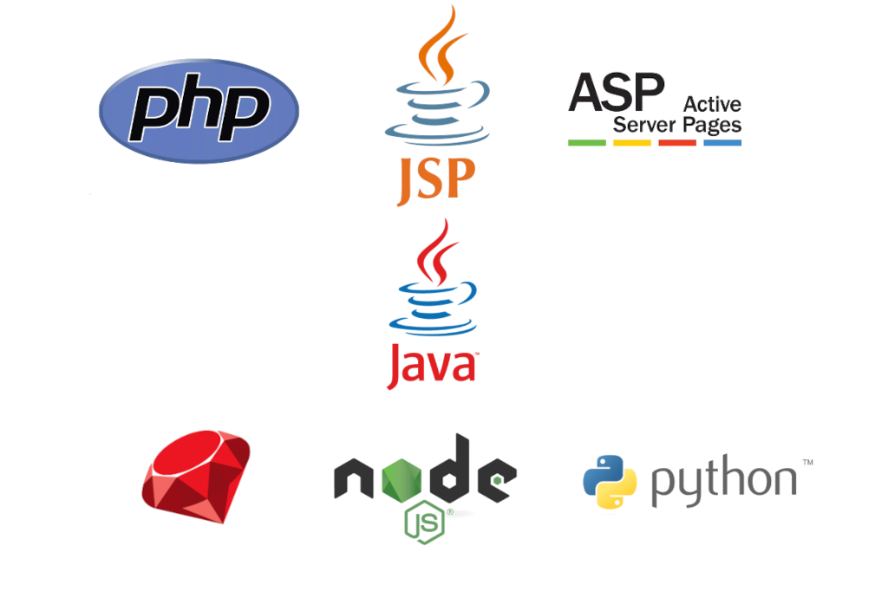
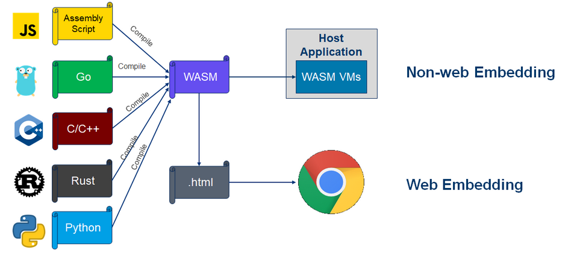
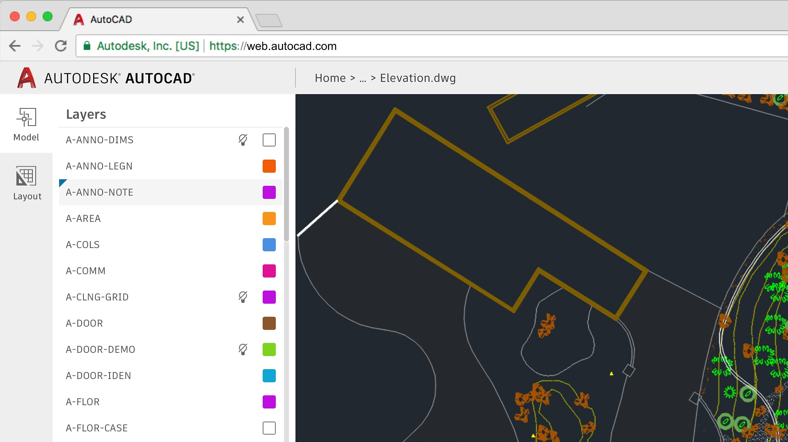

> DESARROLLO WEB EN ENTORNO SERVIDOR

# Tema 1: Selección de arquitecturas y herramientas de programación <!-- omit in toc -->
> CONCEPTOS, BACKEND, FRONTEND, MVC, MPA, SPA, LENGUAJES, FRAMEWORKS

- [1. Introducción](#1-introducción)
  - [1.1. La base de la web](#11-la-base-de-la-web)
  - [1.2. Partes de una aplicación web](#12-partes-de-una-aplicación-web)
- [2. Tecnologías para el backend](#2-tecnologías-para-el-backend)
  - [2.1. Lenguajes del lado del servidor](#21-lenguajes-del-lado-del-servidor)
  - [2.2. Frameworks del lado servidor](#22-frameworks-del-lado-servidor)
  - [2.3. Resumen](#23-resumen)
- [3. Tecnologías para el frontend](#3-tecnologías-para-el-frontend)
  - [3.1. Lenguajes del lado del cliente](#31-lenguajes-del-lado-del-cliente)
  - [3.2. Frameworks del lado cliente](#32-frameworks-del-lado-cliente)
  - [3.3. Resumen](#33-resumen)
- [4. Tecnologías Javascript Fullstack](#4-tecnologías-javascript-fullstack)
  - [4.1. Frameworks para servidor y cliente](#41-frameworks-para-servidor-y-cliente)
- [5. MVC o SPA](#5-mvc-o-spa)
  - [5.1. Modelo-Vista-Controlador](#51-modelo-vista-controlador)
  - [5.2. Single Page Application](#52-single-page-application)
  - [5.3. MVC vs SPA](#53-mvc-vs-spa)
  - [5.4. Arquitectura de 3 capas](#54-arquitectura-de-3-capas)
- [6. Persistencia de los datos](#6-persistencia-de-los-datos)
  - [6.1. Bases de datos relacionales](#61-bases-de-datos-relacionales)
  - [6.2. Bases de datos no relacionales (noSQL)](#62-bases-de-datos-no-relacionales-nosql)
- [7. Viajando al futuro, que ya es presente](#7-viajando-al-futuro-que-ya-es-presente)
  - [7.1. WebAssembly (Wasm)](#71-webassembly-wasm)
  - [7.2. Apps en Wasm](#72-apps-en-wasm)

---

# 1. Introducción

## 1.1. La base de la web

- **HTML**: Estructura del documento. `HTML5`. `2014`
- **CSS**: Formato/apariencia del documento. `CSS3`. 
- **Javascript**: Funcionalidad del documento. `ECMAScript6`. `2015`

> **NOTA**  
> 
> Al final de línea se muestra la versión más relevante actualmente y el año de su aparición oficial.

## 1.2. Partes de una aplicación web

- **Backend**: parte que se ejecuta en el servidor.
  - Se encarga de atender las peticiones de los clientes.
  - Suele tener soporte de almacenamiento de datos.
  - También se denomina capa de acceso a datos
- **Frontend**: parte que se ejecuta en el cliente.
  - Se encarga de la experiencia del usuario (UX).
  - Puede tener soporte de cache de datos.
  - También se denomina capa de presentación.

# 2. Tecnologías para el backend

## 2.1. Lenguajes del lado del servidor

- **PHP**: PHP Hypertext Preprocessor. Uno de los lenguajes más utilizados para la creación de todo tipo de CMS.
- **JSP**: JavaServer Pages. Es la propuesta de Java, y uno de los más demandados.
- **ASP**: Active Server Pages. Es el lenguaje de desarrollo web de Microsoft. 
- **Java**: es un lenguaje multiplataforma propiedad de Oracle.
- **Ruby**: es un lenguaje de programación interpretado, reflexivo y orientado a objetos.
- **Python**: es un lenguaje de programación multiparadigma que hace hincapié en el código legible. 
- **Javascript (Node.js)**: cada vez más popular puesto que se usa también en el lado cliente.

## 2.2. Frameworks del lado servidor 

- PHP: **Laravel**, **Symfony**.
- JSP, Java: **Spring**.
- ASP: **ASP.NET**, **ASP.NET Core**.
- Ruby: **Ruby on rails**.
- Python: **Django**.
- Node.js: **Express**. 

## 2.3. Resumen

# 3. Tecnologías para el frontend

## 3.1. Lenguajes del lado del cliente

## 3.2. Frameworks del lado cliente

- **Angular**
- **React**
- **Vue**
- **Svelte** (compilador)

## 3.3. Resumen

# 4. Tecnologías Javascript Fullstack

## 4.1. Frameworks para servidor y cliente 

- **Universal**
- **Next**
- **Nuxt**
- **SvelteKit**

# 5. MVC o SPA

## 5.1. Modelo-Vista-Controlador

- patrón de diseño arquitectónico
- se ejecuta casi toda la lógica de aplicación en el backend. 
- el servidor sirve múltiples vistas, cada vista es una página HTML. 
- es una aplicación de múltiples páginas (MPA). 

https://es.wikipedia.org/wiki/Modelo%E2%80%93vista%E2%80%93controlador 

## 5.2. Single Page Application

- se ejecuta gran parte de la lógica de la aplicación en el frontend. 
- el servidor sirve datos mediante una API web. 
- principalmente se usan 2 formatos para el intercambio de datos:
  - **XML**
  - **JSON** 

## 5.3. MVC vs SPA

## 5.4. Arquitectura de 3 capas

# 6. Persistencia de los datos

- Uso de archivos
- Bases de datos relacionales
  - Subtipo importante: **BBDD objeto-relacionales**.
- Bases de datos no relacionales
  - Subtipo importante: **BBDD noSQL**.

## 6.1. Bases de datos relacionales

## 6.2. Bases de datos no relacionales (noSQL)

# 7. Viajando al futuro, que ya es presente

- [WebAssembly](https://es.wikipedia.org/wiki/WebAssembly)

## 7.1. WebAssembly (Wasm)

- Formato binario pequeño y rápido que promete un rendimiento casi nativo para las aplicaciones web.
- Los principales navegadores son compatibles con WebAssembly.
- Los desarrolladores escriben en el lenguaje de su elección (C, C++, ...), que luego se compila en bytecode WebAssembly.
- Para casos de uso intensivo de rendimiento, como juegos, transmisión de música, edición de vídeo y aplicaciones CAD.

- [WebAssembly explicado](https://www.ciospain.es/liderazgo--gestion-ti/que-es-webassembly-la-plataforma-web-de-proxima-generacion-explicada)

## 7.2. Apps en Wasm

- [Algunas aplicaciones desarrolladas para WebAssembly](https://www.campusmvp.es/recursos/post/8-proyectos-espectaculares-que-utilizan-webassembly.aspx)
