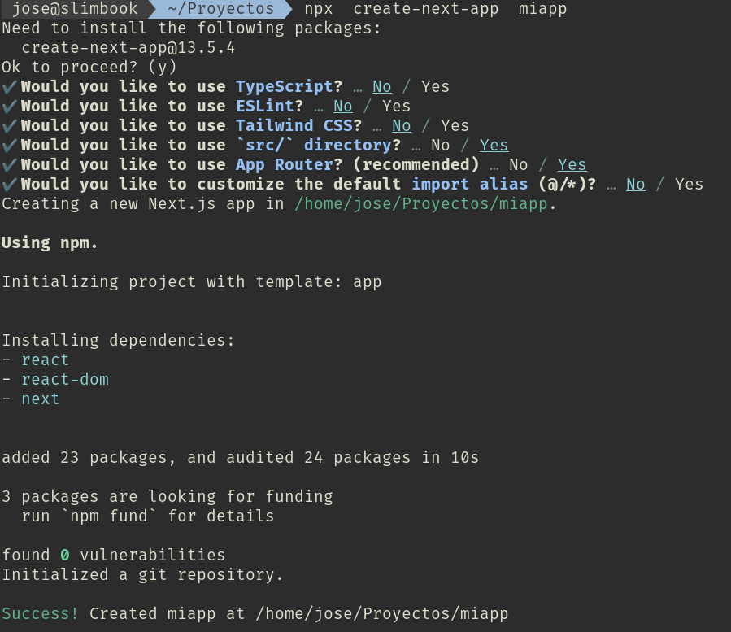

> DESARROLLO WEB EN ENTORNO SERVIDOR

# Tema 4: Desarrollo de aplicaciones Web utilizando código embebido <!-- omit in toc -->
> APP ROUTER, ROUTE HANDLERS, COOKIES

- [1. Introducción](#1-introducción)
- [2. NextJS](#2-nextjs)
  - [2.1. Creación de un proyecto](#21-creación-de-un-proyecto)
  - [2.2. Carpetas y archivos del proyecto](#22-carpetas-y-archivos-del-proyecto)
  - [2.3.](#23)
- [3. App Router](#3-app-router)
- [4. Route Handlers](#4-route-handlers)
- [5. Cookies](#5-cookies)


--- 

# 1. Introducción


# 2. NextJS

Next es un **framework fullstack JavaScript**, que emplea React para crear componentes. Y ya no solo componentes de frontend. Gracias a los "**React Server Components (RSC)**" podemos tener componentes que sólo se ejecuten en un entorno de servidor o backend.
Con Next lo que hacemos son aplicaciones Server Side Rendering (SSR), y con los RSC lo que tenemos es Streaming-SSR, una evolución del mismo que nos permite mezclar lo mejor de muchos "mundos".


> **IMPORTANTE**
>
> **Usaremos la versión NextJS 13 o superior.**
>
> En Internet hay mucha documentación de versiones anteriores, pero la forma de trabajar en ellas es ligeramente diferente.


## 2.1. Creación de un proyecto

Para crear proyecto llamado `miapp`

```bash
npx  create-next-app  miapp
```

Nos aparecerá un asistente solicitando las funcionalidades con las que vamos a trabajar. En principio, pulsaremos `Intro` para todo, instalando sólo 3 dependencias: `react`, `react-dom` y `next`.


 

Para entrar dentro del proyecto

```bash
cd  miapp
```

Para editar el código con VSCode

```bash
code  .
```

## 2.2. Carpetas y archivos del proyecto


Los archivos que aparecen dentro de la carpeta `src/app` son:

- `favicon.ico`: icono de la aplicación
- `globals.css`: estilos CSS globales
- `layout.js`: plantilla o layout de la aplicación
- `page.js`: página inicial
- `page.module.css`: estilos CSS para la página principal

Otros archivos opcionales que podemos añadir son:

- `loading.js`: mensaje mientras se carga la página
- `error.js`: mensaje de error, si se da el caso
- `not-found.js`: mensaje de página no encontrada, si se da el caso


## 2.3. 


# 3. App Router


# 4. Route Handlers


# 5. Cookies

```javascript
// damecookie/route.js  => http://localhost:3000/damecookie

import { cookies } from 'next/headers'
import { NextResponse } from 'next/server'


export async function GET() {
    // Creamos cookie
    cookies().set("token", JSON.stringify({ id: 1, user: "Pepe", fecha: new Date() }))

    // Leemos cookie
    const data = cookies().get('token').value
    const cookie = JSON.parse(data)
    cookie.fecha = new Date(cookie.fecha)

    // Mostramos información de la cookie
    console.log(
        cookie.id,
        cookie.user,
        cookie.fecha.getDate(), 
        cookie.fecha.getMonth() + 1,
        cookie.fecha.getFullYear(),
        cookie.fecha.getHours(),
        cookie.fecha.getMinutes(),
        cookie.fecha.getSeconds()
        )

    return NextResponse.json({ mensaje: 'Cookie enviada' })
}
```
