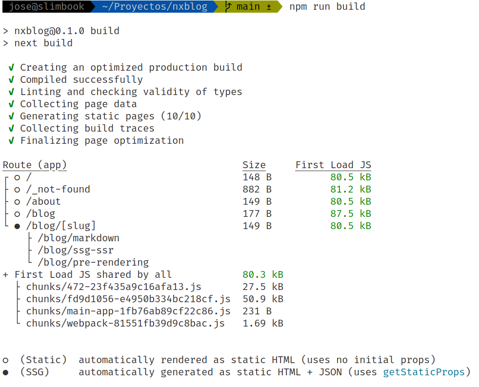

> DESARROLLO WEB EN ENTORNO SERVIDOR

# Tema 5: Generación dinámica de páginas Web  <!-- omit in toc -->
> SSG, SERVER ACTIONS, FORMULARIOS 

- [1. Introducción](#1-introducción)
- [2. SSG](#2-ssg)
- [3. Server Actions](#3-server-actions)
- [4. Formularios](#4-formularios)
- [5. Referencias](#5-referencias)


--- 

# 1. Introducción

El envío de información por parte del usuario al servidor se realiza a través de formularios. Por tanto su correcto manejo es de gran importancia.

En este tema veremos, principalmente, como trabajar con formularios en NextJS. 

También incluimos en este tema la técnica `SSG`, aunque no tiene relación con los formularios.


# 2. SSG

**Static Site Generat{ion,or,ed}**

Los generadores de sitios estáticos (SSG) son motores que utilizan archivos de entrada de texto (como Markdown , reStructuredText y AsciiDoc ) para generar páginas web estáticas. Los sitios estáticos generados por generadores de sitios estáticos no requieren un backend después de la generación del sitio, lo que los convierte en ciudadanos de primera clase en las redes de entrega de contenido (CDN). Algunos de los generadores de sitios estáticos más populares son:

Framework  | Lenguaje
-----------|----------
Jekyll     | Ruby
Hugo       | Go
Gatsby     | Javascript
Next.js    | Javascript
Astro      | Javascript

Una lista exhaustiva puede encontrarse en [jamjstack.org](https://jamstack.org/generators/)

**Los SSG suelen ser para contenido informativo que rara vez cambia**, como páginas de productos, sitios web de noticias, documentación (software), manuales y blogs.


**Ejemplo**

La estructura de carpetas del proyecto es la siguiente:

```sh
.
├── jsconfig.json
├── next.config.js
├── package.json
├── package-lock.json
├── posts
│   ├── markdown.md
│   ├── pre-rendering.md
│   └── ssg-ssr.md
├── public
│   ├── avatar.png
│   ├── next.svg
│   └── vercel.svg
├── README.md
└── src
    ├── app
    │   ├── about
    │   │   └── page.js
    │   ├── blog
    │   │   ├── layout.js
    │   │   ├── page.js
    │   │   └── [slug]
    │   │       ├── error.js
    │   │       └── page.js
    │   ├── favicon.ico
    │   ├── globals.css
    │   ├── layout.js
    │   ├── not-found.js
    │   └── page.js
    └── components
        ├── getPosts.js
        └── PostPreview.js
```

Para convertir rutas, que en un principio son dinámicas (creadas mediante parámetros de ruta), necesitamos indicar qué rutas estaran finalmente disponibles. Para ello usamos **`generateStaticParams()`** (ver archivo `src/app/blog/[slug]/page.js`). Esta función permite generar de forma estática esas rutas durante el proceso de construcción (build time).



Un aspecto muy recomendable es disponer de los siguientes archivos:

- `not-found.js`
- `error.js`

En este ejemplo, se mostrará `No encontrado` cuando el usuario acceda a rutas distintas de las siguientes:

- ✅ / 
- ✅ /about
- ✅ /blog

Por ejemplo, rutas que mostrarán `No encontrado` son:

- ❌ /hola
- ❌ /acerca
- ❌ /posts

Se mostrará `Error` cuando el usario acceda a rutas distintas de las siguientes:

- ✅ /blog/markdown
- ✅ /blog/ssg-ssr
- ✅ /blog/pre-rendering

Por ejemplo, rutas que provocaran `Error` son:

- ❌ /blog/este-post-no-existe
- ❌ /blog/este-tampoco
  

- [Código fuente](https://github.com/jamj2000/nxblog)
- [Demo](https://jamblog.vercel.app/)


**Ejemplo 2**

En este ejemplo, nos ahorramos que utilizar `generateStaticParams()`. 

Para ello hacemos uso de [`MDX`](https://mdxjs.com/). Existe un tutorial en [dev.to](https://dev.to/mikeesto/next-js-mdx-w-code-highlighting-16fi)

La estructura de carpetas es la siguiente:

```
.
├── jsconfig.json
├── next.config.js
├── next-env.d.ts
├── package.json
├── package-lock.json
├── public
│   ├── next.svg
│   └── vercel.svg
├── README.md
├── src
│   ├── app
│   │   ├── favicon.ico
│   │   ├── globals.css
│   │   ├── layout.js
│   │   ├── mdx
│   │   │   └── page.mdx
│   │   └── page.js
│   └── mdx-components.tsx
└── tsconfig.json
```

- [Código fuente](https://github.com/jamj2000/nxmdx)
- [Demo](https://nxmdx.vercel.app/mdx)

# 3. Server Actions

Las acciones de servidor son funciones que serán ejecutadas en el servidor. Fueron introducidas en NextJS 13. 

**Se usan habitualmente para procesar, en el lado servidor, datos procedentes de un formulario.**


# 4. Formularios


[Código fuente](https://github.com/jamj2000/nxform)


[Código fuente](https://github.com/jamj2000/nxfactions)


# 5. Referencias

