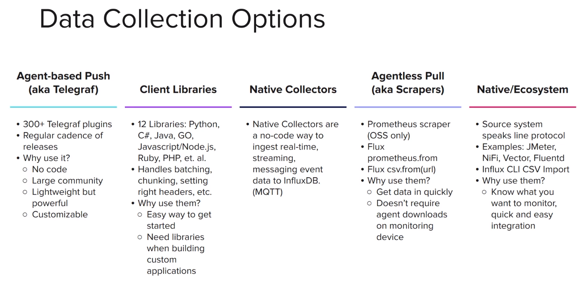
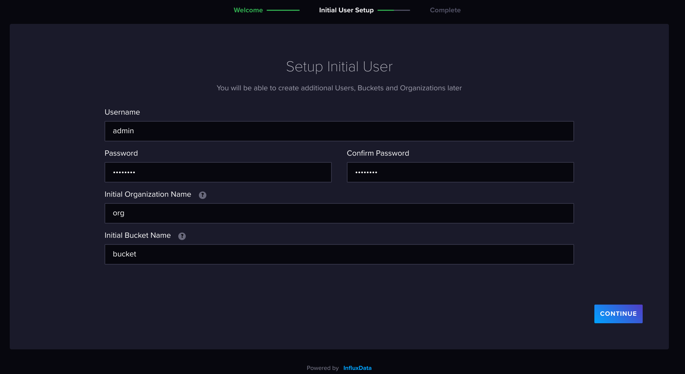
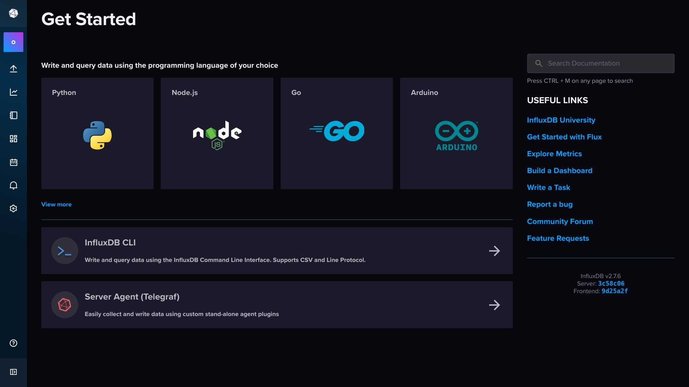
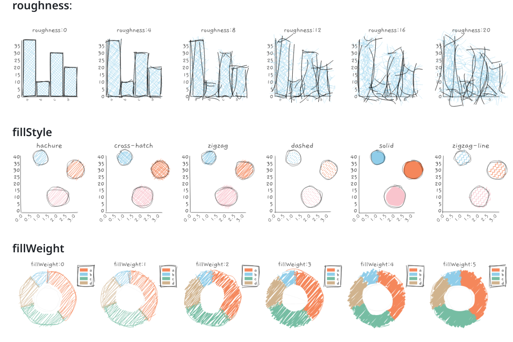
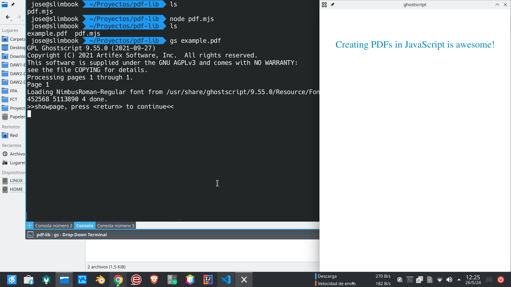
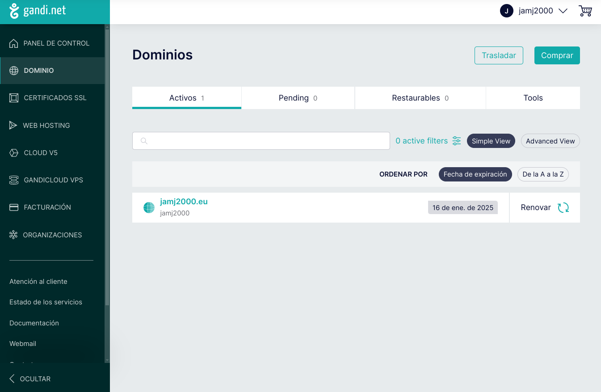
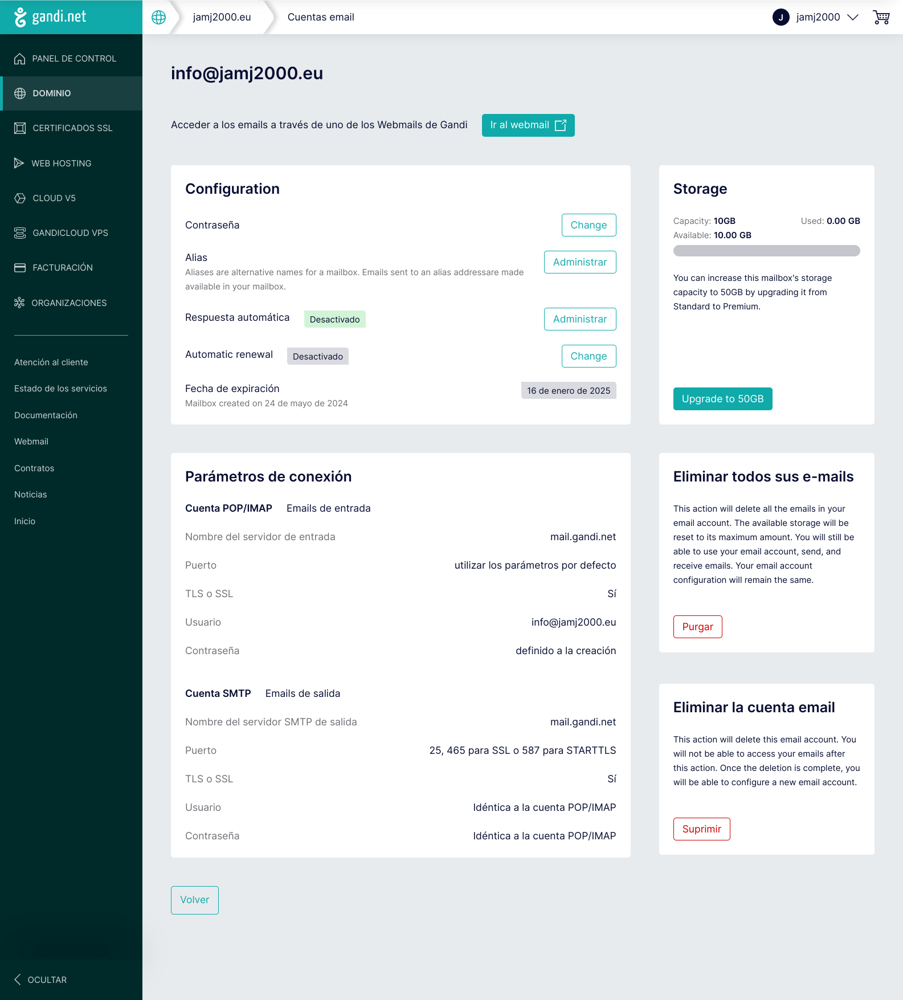

> DESARROLLO WEB EN ENTORNO SERVIDOR

# Tema 7: Programación de servicios Web <!-- omit in toc -->
> FUNCIONALIDADES EN LAS APP WEB.

**[`PROYECTOS DE EJEMPLO`](proyectos)**


---

- [1. Introducción](#1-introducción)
- [2. Datos ficticios](#2-datos-ficticios)
  - [2.1. Instalación de biblioteca](#21-instalación-de-biblioteca)
  - [2.2. Uso](#22-uso)
  - [2.3. Documentación](#23-documentación)
- [3. Datos de archivos CSV](#3-datos-de-archivos-csv)
  - [3.1. Instalación de biblioteca](#31-instalación-de-biblioteca)
  - [3.2. Uso](#32-uso)
  - [3.3. Documentación](#33-documentación)
  - [3.4. Caso práctico y truco](#34-caso-práctico-y-truco)
- [4. Arrastrar y Soltar (Drag \& Drop)](#4-arrastrar-y-soltar-drag--drop)
  - [4.1. Instalación de biblioteca](#41-instalación-de-biblioteca)
  - [4.2. Uso](#42-uso)
  - [4.3. Documentación](#43-documentación)
- [5. Gráficos](#5-gráficos)
  - [5.1. Instalación](#51-instalación)
  - [5.2. Uso](#52-uso)
  - [5.3. Flujo de datos (streaming)](#53-flujo-de-datos-streaming)
    - [5.3.1. Los modelos de provisión de datos](#531-los-modelos-de-provisión-de-datos)
    - [5.3.2. Ejemplo](#532-ejemplo)
    - [5.3.3. Colas de mensajes](#533-colas-de-mensajes)
    - [5.3.4. InfluxDB](#534-influxdb)
  - [5.4. Documentación](#54-documentación)
  - [5.5. Curiosidad](#55-curiosidad)
- [6. Creación de PDFs](#6-creación-de-pdfs)
  - [6.1. Instalación](#61-instalación)
  - [6.2. Uso](#62-uso)
  - [6.3. Documentación](#63-documentación)
- [7. Envío de correos](#7-envío-de-correos)
  - [7.1. Instalación](#71-instalación)
  - [7.2. Uso](#72-uso)
  - [7.3. Documentación](#73-documentación)
- [8. Pagos por internet](#8-pagos-por-internet)
  - [8.1. Instalación](#81-instalación)
  - [8.2. Uso](#82-uso)
  - [8.3. Documentación](#83-documentación)
- [9. Mapas](#9-mapas)
  - [9.1. Instalación](#91-instalación)
  - [9.2. Uso](#92-uso)
  - [9.3. Documentación](#93-documentación)
- [10. Coloreado de código](#10-coloreado-de-código)
  - [10.1. Instalación](#101-instalación)
  - [10.2. Uso](#102-uso)
  - [10.3. Documentación](#103-documentación)
    


--- 


> **IMPORTANTE: MATERIAL PARA EL PRÓXIMO CURSO 2024/25**
>
> El contenido previo de este tema ha sido movido al [Tema 6](../Tema6). Este contenido es nuevo, y está previsto su uso en el próximo curso.

 

# 1. Introducción

En este tema añadiremos nuevas funcionalidades a nuestra aplicación web. En concreto, se estudiarán las siguientes funcionalidades:

- **Datos ficticios**
- **Datos de archivos CSV**
- **Gráficos**
- **Creación de PDFs**
- **Envío de correos**
- **Pagos por internet**
- **Mapas**
- **Coloreado de código**


# 2. Datos ficticios

Durante el desarrollo de una aplicación a menudo necesitamos datos *fake* para probar su funcionalidad. Para ello disponemos de la biblioteca **[faker.js](https://fakerjs.dev/)**, la cual nos provee de este tipo de datos. 

Esta biblioteca puede usarse desde el lado cliente y desde el lado servidor.

## 2.1. Instalación de biblioteca

Instalamos como **dependencia de desarrollo**. Aparecerá en la sección `devDependencies` en el archivo `package.json`.


```console
npm install -D @faker-js/faker
```

> **IMPORTANTE:**
>
> Esta biblioteca ocupa unos cuantos MB.


## 2.2. Uso


```js
import { faker } from '@faker-js/faker';

// Algunos datos disponibles.
// Para ver un listado exhaustivo, consulta la API
faker.number.int()
faker.number.int({ min: 10, max: 100 })
faker.number.float() 
faker.number.float({ min: 10, max: 100, multipleOf: 0.02 }) 
faker.person.firstName() 
faker.person.firstName('female') 
faker.person.firstName('male') 
faker.person.lastName()
faker.person.fullName()
faker.person.bio()
faker.internet.email()
faker.internet.email({ firstName: 'Jeanne', lastName: 'Doe' }) // 'Jeanne_Doe63@yahoo.com'
faker.internet.email({ firstName: 'Jeanne', lastName: 'Doe', provider: 'example.dev' }) // 'Jeanne_Doe88@example.dev'
faker.animal.dog()   // 'Irish Water Spaniel'
faker.animal.cat()   // 'Singapura'
faker.animal.horse() // 'Swedish Warmblood'
faker.image.avatar()
faker.image.city()
```


## 2.3. Documentación

- [Guía](https://fakerjs.dev/guide/)
- [API. Tipos de datos proporcionados](https://fakerjs.dev/api/)


# 3. Datos de archivos CSV

Es posible que se te presente la posibilidad de realizar una aplicación que requiera el uso de datos de poca complejidad y de sólo lectura. En estos casos es problable que usar una BD sea algo parecido a *matar moscas a cañonazos*. 

Disponemos de una biblioteca  llamada **[Papa Parse](https://www.papaparse.com/)** que nos permite almacenar nuestros datos en uno o varios [archivos CSV](https://es.wikipedia.org/wiki/Valores_separados_por_comas), y realizar las consultas deseadas sobre ellos. 

Esta biblioteca puede usarse desde el lado cliente y desde el lado servidor.

## 3.1. Instalación de biblioteca

 ```sh
npm  install  papaparse
 ```


## 3.2. Uso


```js
import Papa from 'papaparse';

Papa.parse(file, config);
```

A continuación tienes los enlaces a 2 proyectos que hacen uso de esta biblioteca.

- [Aplicación de lado cliente para rellenar fichas semanales](https://github.com/jamj2000/semana-fct)
- [Aplicación de lado servidor para consultar biblioteca de libros](https://github.com/jamj2000/book-inventory)

La segunda aplicación contiene los datos en el archivo [book.csv](https://github.com/jamj2000/book-inventory/blob/main/books.csv). CUIDADO: son unos 7OMB.

Para cargar grandes cantidades de datos desde CSV a una BD consulta el siguiente vídeo:

- [Loading Large CSVs into a Vercel Postgres Database](https://youtu.be/RbDcTraZwQA?si=PEv-tX-Q6L3QHtrS)


## 3.3. Documentación

- [Sitio oficial](https://www.papaparse.com/)
- [Repositorio en Github](https://github.com/mholt/PapaParse?tab=readme-ov-file)


## 3.4. Caso práctico y truco

Si tenemos un archivo `localidades.csv` con los datos en formato CSV, podemos convertirlos fácilmente a datos JSON con algún conversor, como [csvjson.com](https://csvjson.com/) y guardarlos en un archivo `localidades.json`.

Los datos CSV siguientes

```csv
"id","nombre","temp_ext_ver","hr_ext_ver","temp_ext_inv","hr_ext_inv","altitud","zona_climatica"
1,"Álava (Vitoria / Aeropuerto de Foronda)",30.1,49,-2.4,96,508,"D"
2,"Albacete (Los Llanos-Base Aérea)",34.2,25,-3,92.3,704,"D"
3,"Albacete (Hellín)",36.7,27,1.5,70.4,520,"D"
```

se convertirán en los datos JSON siguientes

```json
[
    {
        "id": 1,
        "nombre": "Álava (Vitoria / Aeropuerto de Foronda)",
        "temp_ext_ver": 30.1,
        "hr_ext_ver": 49,
        "temp_ext_inv": -2.4,
        "hr_ext_inv": 96,
        "altitud": 508,
        "zona_climatica": "D"
    },
    {
        "id": 2,
        "nombre": "Albacete (Los Llanos-Base Aérea)",
        "temp_ext_ver": 34.2,
        "hr_ext_ver": 25,
        "temp_ext_inv": -3,
        "hr_ext_inv": 92.3,
        "altitud": 704,
        "zona_climatica": "D"
    },
    {
        "id": 3,
        "nombre": "Albacete (Hellín)",
        "temp_ext_ver": 36.7,
        "hr_ext_ver": 27,
        "temp_ext_inv": 1.5,
        "hr_ext_inv": 70.4,
        "altitud": 520,
        "zona_climatica": "D"
    }
]
```


**NextJS tiene soporte nativo para datos JSON**. Por ejemplo, podemos hacer

``` js
import localidades from '@/lib/localidades.json'  

// ...

console.log( localidades.find ( localidad => localidad.id == 1 ) )  // Mostramos localidad con id 1
```

De esta forma tan sencilla, nos ahorramos tener que usar papaparse, y así reducir dependencias y simplificar el desarrollo.


# 4. Arrastrar y Soltar (Drag & Drop)

La funcionalidad de arrastrar y soltar es propia del lado cliente y por tanto deberá ser usada desde componentes cliente. Además de poder realizarla con Vanilla JS, también disponemos de 2 bibliotecas interesantes, que son:

- **[DnD Kit](https://docs.dndkit.com/)**
- **[React DnD](https://react-dnd.github.io/react-dnd/docs/overview)**

A diferencia de muchas bibliotecas de arrastrar y soltar, **DnD Kit** no está construido intencionalmente sobre la API de arrastrar y soltar HTML5. Esta fue una decisión arquitectónica deliberada, que conlleva desventajas que debe conocer antes de decidir usarla. Para la mayoría de las aplicaciones web, creemos que los beneficios superan las desventajas.

La API de arrastrar y soltar de HTML5 tiene algunas limitaciones severas. No es compatible con dispositivos táctiles, lo que significa que las bibliotecas que se construyen sobre ella deben exponer una implementación completamente diferente para admitir dispositivos táctiles.

La principal desventaja de que **DnD Kit** no use la API de arrastrar y soltar de HTML5 es que no podrá arrastrar desde el escritorio o entre ventanas. 
Si el caso de uso de arrastrar y soltar que tiene en mente implica este tipo de funcionalidad, definitivamente querrá usar una biblioteca que esté construida sobre la API de arrastrar y soltar de HTML5. 
Le recomendamos que consulte [`react-dnd`](https://react-dnd.github.io/react-dnd/about) para obtener una biblioteca de React que tenga un backend de arrastrar y soltar de HTML5 nativo.

|           | Soporta pantallas táctiles | DnD desde escritorio y entre ventanas |
| --------- | :------------------------: | :-----------------------------------: |
| DnD Kit   |             ✓              |                   𐄂                   |
| React DnD |             𐄂              |                   ✓                   |


## 4.1. Instalación de biblioteca

```sh
npm  install  react  react-dom  @dnd-kit/core 
```

```sh
npm  install  react  react-dom  react-dnd  react-dnd-html5-backend
```

## 4.2. Uso

- Para DnD Kit seguir la siguiente guía: https://docs.dndkit.com/introduction/getting-started
- Para React DnD seguir el siguiente tutorial: https://react-dnd.github.io/react-dnd/docs/tutorial 


## 4.3. Documentación

- [DnD Kit](https://docs.dndkit.com/)
- [React DnD](https://react-dnd.github.io/react-dnd/docs/overview)
  

# 5. Gráficos

Esta biblioteca debe ser usada desde el lado cliente.

Otra de las funcionalidades que a menudo es requerida es la de presentación de información en forma gráfica. Suele tratarse de diagramas para la exposición de datos o de monitorización de ellos (en algunos casos en tiempo real). En este último caso, los gráficos suelen estar incorporados en un Dashboard o Panel del usuario. 

La web W3Schools tiene una [introdución a los gráficos](https://www.w3schools.com/ai/ai_graphics.asp) explicando brevemente las bibliotecas más habituales para el trabajo con gráficos.

Nosotros usaremos la biblioteca [chart.js](https://www.chartjs.org/) por ser una de las más populares. Además es sencilla de usar y tiene licencia MIT, la cual es muy permisiva.

Hay una [demo disponible en Vercel](https://nxchart.vercel.app). El código fuente está disponible en:

- [Código fuente](https://github.com/jamj2000/nxchart)


> **NOTA:** Otra biblioteca muy interesante es [`plotly para javascript`](https://plotly.com/javascript/). Es una biblioteca originalmente desarrollada para el lenguaje Python.
> 
> 
> ```sh
> npm  install  plotly.js-dist-min
> ```
> Características:
> - Mayor cantidad de gráficas de chart.js
> - Mayor interactividad
> - Buena integración con datos en tiempo real
>
> A pesar de sus interesantes características, una desventaja muy importante es que su integración con NextJS es bastante mala. Sin embargo funciona muy bien con Vanilla JS.
>
> Más documentación:
> - [Fundamentos](https://plotly.com/javascript/plotly-fundamentals/)
> - [Integración con React](https://plotly.com/javascript/react/) (`npm  install  react-plotly.js  plotly.js`)


## 5.1. Instalación

```console
npm  install  chart.js  react-chartjs-2
```

El segundo paquete (`react-chartjs-2`) nos permitirá usar directamente componentes de React, en lugar de Vanilla JS.


## 5.2. Uso


La forma más rápida y directa de empezar a usar esta biblioteca es usando el siguiente esquema. 

```js
import { Chart } from 'chart.js/auto'   // versión 4 de chartjs
import { Line } from 'react-chartjs-2';

const options = {
  plugins: {
    title:   /* ... */,
    legend:  /* ... */,
  },
  scales:    /* ... */,
}

const data = {
    labels:  /* ... */,
    datasets: [
        {
            label: /* ... */,
            data:  /* ... */,
        },
        {
            label: /* ... */,
            data:  /* ... */,
        }
    ],
};

export default function grafico() {
    return (
        <div className='contenedor '>
            <Line options={options} data={data} />
        </div>
    )
}
```

Sin embargo, para despliegue en producción, en lugar de usar `import { Chart } from 'chart.js/auto'` es recomendable usar la forma que aparece a continuación, puesto que reducirá el peso del código resultante. En este segundo caso deberemos importar los componentes especificos que vayamos a necesitar y además realizar un registro de ellos.

```js
// Esto es un ejemplo para un gráfico tipo Scatter.
// Para otro tipo de gráfico necesitarás importar otros componentes.
import {
  Chart,
  LinearScale,
  PointElement,
  Tooltip,
  Legend,
} from 'chart.js';

Chart.register(LinearScale, PointElement, Tooltip, Legend);
```


Haciendo uso del paquete `react-chartjs-2` importamos el tipo de gráfico deseado. En el ejemplo que viene a continuación importamos un gráfico de tipo `Scatter`.

Luego seguimos el siguiente procedimiento:

1. Definimos un constante `options` con la configuración general del gráfico.
2. Definimos una constante `data` con la configuración específica del gráfico.
3. Usamos el componente pasándole las propiedades anteriores.


```js
import { Scatter } from 'react-chartjs-2';

const options = {
    scales: {
        y: {
            beginAtZero: true,
        },
    },
};

const data = {
    datasets: [
        {
            label: 'Puntos aleatorios',   
            data: Array.from({ length: 100 }, () => ({  // 100 puntos 
                x: Math.random(),
                y: Math.random(),
            })),
            backgroundColor: 'rgba(255, 99, 132, 1)',
        },
    ],
};

export default function grafico() {
    return (
        <div className='contenedor '>
            <Scatter options={options} data={data} />
        </div>
    )
}
```

El gráfico debe estar dentro de un **elemento contenedor**. El contenedor padre debe cumplir los siguientes requisitos para que el comportamiento sea [responsive](https://www.chartjs.org/docs/latest/configuration/responsive.html):

- Tener `position: relative` en su estilo CSS. 
- Dedicarse únicamente al lienzo del gráfico.

Chart.js usa su contenedor principal para actualizar el renderizado del lienzo (`canvas`) y los tamaños de visualización. Sin embargo, este método requiere que el contenedor esté relativamente posicionado y dedicado únicamente al lienzo del gráfico.


> **IMPORTANTE:**
>
> La página donde vaya a incrustarse el gráfico debe contener la directiva **`'use client'`**


## 5.3. Flujo de datos (streaming)

En algunos casos deseamos que la gráfica muestre un flujo de datos (**streaming**) obtenido de alguna fuente. Para ello podemos usar el plugin [chartjs-plugin-streaming](https://nagix.github.io/chartjs-plugin-streaming/latest/). Su página web dispone de varios [ejemplos](https://nagix.github.io/chartjs-plugin-streaming/latest/samples/charts/line-horizontal.html).

El sitio oficial también dispone de una [guía](https://nagix.github.io/chartjs-plugin-streaming/latest/guide/) bastante detallada.

Entre toda la información podemos destacar:

1. [Los modelos de provisión de datos](https://nagix.github.io/chartjs-plugin-streaming/latest/guide/data-feed-models.html)
2. [El tutorial para crear app en React, también aplicable a Next.js](https://nagix.github.io/chartjs-plugin-streaming/latest/tutorials/react/app.html)

### 5.3.1. Los modelos de provisión de datos

El paquete `chartjs-plugin-streaming` soporta obtención de datos mediante los modos **pull** y **push**. Para mayor información consulta la [documentación oficial](https://nagix.github.io/chartjs-plugin-streaming/latest/guide/data-feed-models.html#push-model-listening-based)


### 5.3.2. Ejemplo

Hay disponible una aplicación de ejemplo con [código fuente disponible en Github](https://github.com/jamj2000/nxchart-streaming).


**Ejecución en entorno de desarrollo**

```console
git clone  https://github.com/jamj2000/nxchart-streaming.git
cd  nxchart-streaming
npm install
npm run dev
```

**Ejecución en entorno de producción**

**IMPORTANTE**: El grafico6 hace uso del plugin `chartjs-plugin-zoom` para ofrecer funcionalidad de zoom y pan. Sin embargo este plugin provoca un error en el proceso de construcción. Por tanto el comando `npm run build` fallará. Si deseas llevar esta aplicación a producción, elimina este plugin del archivo `src/components/grafico6.js`.


**Resumen del proceso de desarrollo**

```console
npm  install  chart.js@3 react-chartjs-2@4 luxon chartjs-adapter-luxon chartjs-plugin-streaming chartjs-plugin-zoom chartjs-plugin-annotation@1 --legacy-peer-deps
```

> **IMPORTANTE:** 
>
> **A fecha de Abril de 2024, este plugin de streaming no soporta chartjs v4, por tanto debemos instalar los paquetes más antiguos usando el comando anterior**

Los paquetes instalados son los siguientes:

- `luxon`: biblioteca para manejo de fechas y horas
- `chartjs-adapter-luxon`: adaptador de la biblioteca anterior
- `chartjs-plugin-annotation`: plugin para realizar anotaciones en el gráfico
- `chartjs-plugin-streaming`: plugin para hacer streaming
- `chartjs-plugin-zoom`: plugin opcional. Para hacer zoom y pan 


```js
'use client'
import { Line } from 'react-chartjs-2';
import Chart from 'chart.js/auto';         // IMPORTANTE: versión 3 de chartjs. La forma de importar es distinta
import annotationPlugin from 'chartjs-plugin-annotation';

import 'chartjs-adapter-luxon';
import ChartStreaming from 'chartjs-plugin-streaming';


const onRefresh = (chart) => {
 /* ... */
};


const options = {
  responsive: true,
  plugins: {
    title: /* ... */,
    legend: /* ... */,
    annotation: { annotations: {} }  // necesario para ocultar gráfica al pulsar leyenda
  },
  scales: {
    x: {
      type: 'realtime',
      realtime: {
        duration: 20000,
        refresh: 1000,
        delay: 2000,
        onRefresh: onRefresh
      }
    },
    y: {
      title: {
        display: true,
        text: 'Valores'
      }
    }
  },
  interaction: /* ... */,
}


const data = /* ... */;


function grafico() {
  Chart.register(annotationPlugin, ChartStreaming);

  return (
    <div className='contenedor'>
      <Line options={options} data={data} />
    </div>
  );
}

export default grafico
```


### 5.3.3. Colas de mensajes

Una forma de recuperar los datos para realizar las gráficas es mediante el uso de una cola de mensajes.

Una cola de mensajes es una forma de comunicación asíncrona entre múltiples procesos que necesitan transmitirse diferentes datos. De esta forma un sistema añade un mensaje a la cola que se persistirá hasta que otro sistema lo consuma y lo procese. 

La principal ventaja de utilizar las colas de mensajes es desacoplar diferentes sistema. También pueden ser de utilidad cuando quieres procesar múltiples operaciones en lotes, de forma que evites que se produzcan picos en la utilización de tu plataforma y se pueda degradar el servicio.

Herramientas para trabajar con colas de mensajes hay muchas: RabbitMQ, Amazon SQS, algunas más complejas para flujos de eventos como Apache Kafka o Amazon Kinesis, pero realmente puedes utilizar incluso un buffer en memoria aprovechando herramientas como Redis, o incluso MySQL como se indica en la siguiente referencia (incluye vídeo).


**Referencia**:

- [Pirobits: Cola de mensajes usando MySQL: SELECT * FOR UPDATE](https://www.pirobits.com/es/post/cola-de-mensajes-usando-mysql-select-for-update)

### 5.3.4. InfluxDB

No podemos dejar de nombrar al SGBD InfluxDB que es un sistema especialmente diseñado desde cero para trabajar con **base de datos de series temporales**.

InfluxDB ofrece muchas alternativas a la hora de recopilar datos, como puede apreciarse en la siguiente imagen:



Puedes [instalar InfluxDB con Docker](https://github.com/jamj2000/Docker/tree/master/influxdb), y luego realizar la configuración accediendo a http://localhost:8086.







Referencias:

- [Sitio oficial](https://www.influxdata.com/)
- [Qué es InfluxDB y primeros pasos](https://openwebinars.net/blog/que-es-influxdb-y-primeros-pasos/)
- [Compare InfluxDB to SQL databases](https://docs.influxdata.com/influxdb/v1/concepts/crosswalk/#influxql)
- [Paquete de npm para InfluxDB](https://www.npmjs.com/package/@influxdata/influxdb-client)
- [Monitorizando datos con InfluxDB, Telegraf y Grafana](https://openwebinars.net/blog/monitorizando-datos-con-influxdb-telegraf-y-grafana/)  

## 5.4. Documentación

- [Código fuente de ejemplo](https://github.com/jamj2000/nxchart)
- [Código fuente de ejemplo con streaming](https://github.com/jamj2000/nxchart-streaming)
- [Componentes](https://react-chartjs-2.js.org/components/)
- [Ejemplos de react-chartjs-2](https://github.com/reactchartjs/react-chartjs-2/tree/master/sandboxes)
- [Documentación Plugin Streaming](https://nagix.github.io/chartjs-plugin-streaming/latest/)
- [Documentación Plugin Annotation](https://www.chartjs.org/chartjs-plugin-annotation/latest/)
- [Documentación Plugin Zoom](https://www.chartjs.org/chartjs-plugin-zoom/latest/)
- [Más gráficos, plugins,... - Awesome Chart.js](https://github.com/chartjs/awesome/blob/master/README.md)
- [Otra biblioteca de Charts](https://recharts.org)


## 5.5. Curiosidad

Existe un biblioteca para *charting* llamada **`roughViz`**. Como su nombre indica realiza la visualización de forma algo bruta. Sirve para dar un toque de originalidad en detrimento de la exactitud en la representación gráfica.


La [documentación oficial](https://github.com/jwilber/roughViz) nos informa de los tipos de gráficos soportados y de las propiedades que podemos emplear en ellos. Algunas de estas propiedades son las que se muestran a continuación:



Existe [integración para React](https://github.com/Chris927/react-roughviz).


```js
npm  install  react-roughviz
```

```js
'use client'
import {Bar, Pie } from 'react-roughviz'
// ...

    <h3>Bar</h3>
    <Bar
      data='https://raw.githubusercontent.com/jwilber/random_data/master/flavors.csv'
      labels='flavor'
      values='price'
    />
    <h3>Pie</h3>
    <Pie
      data={{
        labels: ['North', 'South', 'East', 'West'],
        values: [10, 5, 8, 3]
      }}
      title='Regions'
      colors={['red', 'orange', 'blue', 'skyblue']}
      roughness={8}
    />

```


# 6. Creación de PDFs 

De las muchas bibliotecas disponibles para trabajar con archivos PDF, una de las más interesantes y potentes es [pdf-lib](https://www.npmjs.com/package/pdf-lib).

Permite crear nuevos documentos y modificar los existentes. Permite trabajar en todos los entornos de JavaScript, no solo en Node o el navegador.

Esta biblioteca puede usarse desde el lado cliente y desde el lado servidor.

## 6.1. Instalación

```sh
npm  install  pdf-lib
```

## 6.2. Uso

Haremos una primera prueba desde NodeJS, sin necesidad de crear un proyecto completo en NextJS. Para ello crea el archivo **pdf.mjs** y ejecútalo directamente con Node. 

```js
// pdf.mjs
import { PDFDocument, StandardFonts, rgb } from 'pdf-lib'
import fs from 'node:fs/promises'

async function createPDF() {
  const pdfDoc = await PDFDocument.create()
  const timesRomanFont = await pdfDoc.embedFont(StandardFonts.TimesRoman)

  const page = pdfDoc.addPage()
  const { width, height } = page.getSize()
  const fontSize = 30
  page.drawText('Creating PDFs in JavaScript is awesome!', {
    x: 50,
    y: height - 4 * fontSize,
    size: fontSize,
    font: timesRomanFont,
    color: rgb(0, 0.53, 0.71),
  })

  const pdfBytes = await pdfDoc.save()

  try {
    await fs.writeFile('example.pdf', pdfBytes);
  } catch (err) {
    console.log(err);
  } 
}

createPDF()
```



> **NOTA**: Una vez hayas comprobado que funciona correctamente, puedes reutilizar la función anterior `createPDF` como *server action* dentro de un proyecto NextJS. 


A continuación tienes los enlaces a 2 proyectos que hacen uso de esta biblioteca.

- [Aplicación de lado cliente para rellenar fichas semanales](https://github.com/jamj2000/semana-fct)
- [Aplicación de tickets de supermercado -por realizar-](#)

## 6.3. Documentación

- [Ejemplos de la Documentación oficial](https://pdf-lib.js.org/#examples)


# 7. Envío de correos

El envío de correos desde una aplicación NodeJS es muy sencillo si usamos el paquete `nodemailer`. La dificultad suele provenir de la configuración del servidor de correo y la cuenta asociada. 

> **NOTA:** Lo que se aplica para NodeJS, también se aplica para NextJS desde el lado servidor.

Es posible usar nuestra cuenta de Gmail para ello, pero Google ha ido restringiendo este tipo de funcionalidad, y actualmente aunque es posible su configuración requiere bastantes pasos y no es tan sencilla como sería esperable.

Otra opción, es usar alguno de los servidores de correo transaccional, entre ellos:

- [Brevo](https://brevo.com)
- [Resend](https://resend.com)
- [Sendgrid](https://sendgrid.com)
- [Mailtrap](https://mailtrap.io/)

Su configuración no suele ser demasiado complicada, pero la integración con el dominio puede dar algunos problemas. Por ejemplo, en mi caso, configurar [resend](https://resend.com) para que use mi dominio registrado con [gandi](https://gandi.net) me ha sido imposible.

Finalmente la opción más sencilla es la siguiente:

1. Registrar un dominio con algún proveedor que ofrezca además alguna cuenta de correo. Por ejemplo, [gandi](https://gandi.net) ofrece 2 cuentas de correo. Los dominios `.eu` suelen ser bastante baratos.



2. Usar los parámetros de conexión para enviar correos con nuestra aplicación.  



3. Si lo deseas, puedes crear alias. Son cuentas de correo adicionales asociadas a la cuenta principal.


## 7.1. Instalación

```sh
npm  install  nodemailer
```

## 7.2. Uso

Haremos una primera prueba desde NodeJS, sin necesidad de crear un proyecto completo en NextJS. Para ello crea el archivo **mail.mjs** y ejecútalo directamente con Node. 

```js
// mail.mjs
import nodemailer from 'nodemailer'

var transporter = nodemailer.createTransport({
  host: "mail.gandi.net",     // coloca aquí tu servidor de correo
  port: 465,
  auth: {
    user: "info@jamj2000.eu", // coloca aquí tu usuario
    pass: "tu_contraseña",    // coloca aquí tu contraseña
  }
});


// async..await no está permitido en el global scope, debemos usar un wrapper
async function sendMail() {
  // send mail with defined transport object
  const info = await transporter.sendMail({
    from: '"José Antonio Muñoz Jiménez 👻" <soporte@jamj2000.eu>', 
    to: "jamj2000@gmail.com, jamunoz@iesincagarcilaso.com, adfadcaxs@afdaadxcdf.com", 
    subject: "Ejemplo con Nodemailer ✔", 
    text: "Mensaje de prueba. Ignoralo.", 
    html: "<h1>Mensaje de prueba</h1><p>Ignoralo</p>"
  });

console.log("Mensaje enviado: %s", info.messageId);
  // Mensaje enviado: <d786aa62-4e0a-070a-47ed-0b0666549519@jamj2000.eu>
console.log('MENSAJES ACEPTADOS: ', info.accepted);
console.log('MENSAJES RECHAZADOS: ', info.rejected);
}

sendMail().catch(console.error);
```


> **NOTA**: Una vez hayas comprobado que el envío de correo funciona correctamente, puedes reutilizar la función anterior `sendMail` como *server action* dentro de un proyecto NextJS. 


## 7.3. Documentación

- [Nodemailer](https://www.nodemailer.com/)
- [react-email](https://react.email/)
- [Resend: Video en español](https://www.youtube.com/watch?v=orYsGPYwkXQ)
- [Resend: Video en inglés](https://www.youtube.com/watch?v=UqQxfpTQBaE)
- [Resend: Video en inglés](https://www.youtube.com/watch?v=T2xaiw7VK4A)


# 8. Pagos por internet


stripe

## 8.1. Instalación


## 8.2. Uso


## 8.3. Documentación


# 9. Mapas


Si deseamos hacer uso de los Mapas de Google, podemos usar la biblioteca [@googlemaps/js-api-loader](https://www.npmjs.com/package/@googlemaps/js-api-loader).

> **NOTA:** Deberás obtener una API KEY de Google.

Esta biblioteca solo puede usarse desde el lado cliente.


## 9.1. Instalación

```sh
npm  install  @googlemaps/js-api-loader
npm  install  @types/google.maps          # Sólo necesario si vamos a usar Typescript
``` 

## 9.2. Uso

**`.env`**

```sh
NEXT_PUBLIC_MAPS_API_KEY="YOUR API KEY"
```


**`src/components/GoogleMaps.js`**

```js
'use client';

import { useEffect, useRef } from 'react';
import { Loader } from '@googlemaps/js-api-loader';


export default function GoogleMaps() {
	const mapRef = useRef(null);

	useEffect(() => {
		const initializeMap = async () => {
			const loader = new Loader({
				apiKey: process.env.NEXT_PUBLIC_MAPS_API_KEY,
				version: "quarterly",
				libraries: ["places"]
			});

			const { Map } = await loader.importLibrary('maps');

			const locationInMap = {
				lat: 37.57869021751064,
				lng: -4.6471375471961025
			};

			// MARKER
			const { AdvancedMarkerElement: Marker } = await loader.importLibrary("marker")

			const options = {
				center: locationInMap,
				zoom: 10,
				mapId: 'DEMO_MAP_ID',
			};

			const map = new Map(mapRef.current, options);

			// add the marker in the map
			const marker = new Marker({
				map: map,
				position: locationInMap,
			});
		};

		initializeMap();
	}, []);

	return <div className="h-[600px]" ref={mapRef} />;
}
``` 

**`src/app/page.js`**

```js
import GoogleMaps from "@/components/GoogleMaps";

export default function Home() {
  return (
    <div className="mx-auto container w-8/12">
    <GoogleMaps />
    </div>
  );
}
```

## 9.3. Documentación

- [Video: Add Google Maps to your Next JS application - Easy way](https://www.youtube.com/watch?v=2xI2RKC4niY)
- [Código fuente del video anterior](https://github.com/MG95Developer/google-maps-tutorial)
- [Documentación oficial](https://googlemaps.github.io/js-api-loader/index.html)
- [Bibliotecas disponibles](https://developers.google.com/maps/documentation/javascript/libraries?hl=es-419)


# 10. Coloreado de código

En el muy poco probable caso de que tengamos que incorporar visualización de código fuente en nuestra aplicación, podemos usar la biblioteca [bright](https://bright.codehike.org/).

Esta biblioteca debe usarse en el lado servidor, aunque es probable que también pueda emplearse en la lado cliente (no la he utilizado).


## 10.1. Instalación

```sh
npm  install  bright
``` 

## 10.2. Uso

```js
import { Code } from "bright"

const myCode = `
let hello = "hello brightness"
console.log(hello, "my old friend")
`.trim()

Code.theme = "github-dark"

export default function Page() {
  return (
    <Code lang="js" title="example.js" lineNumbers>
      {myCode}
    </Code>
  )
}
```


## 10.3. Documentación

- [Documentación oficial](https://bright.codehike.org/)
- [Código en Github](https://github.com/code-hike/bright?tab=readme-ov-file)


