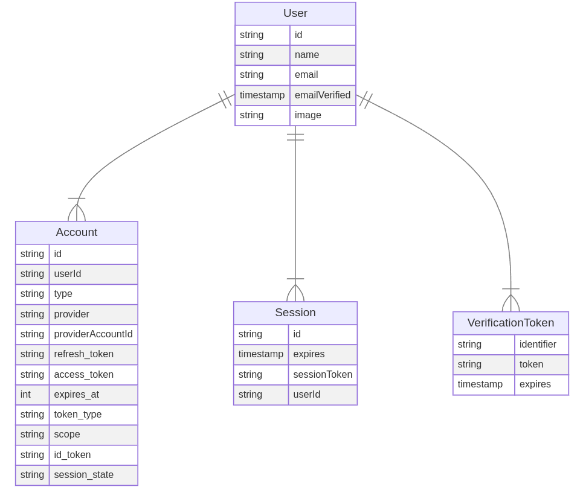

> DESARROLLO WEB EN ENTORNO SERVIDOR

# Tema 8: Generación dinámica de páginas Web interactivas <!-- omit in toc -->
> AUTENTICACIÓN DE USUARIOS, NEXT AUTH. TYPESCRIPT

- [1. Introducción](#1-introducción)
- [2. Instalación de dependencias](#2-instalación-de-dependencias)
- [3. Creación de archivos necesarios](#3-creación-de-archivos-necesarios)
  - [3.1. Archivo .env](#31-archivo-env)
  - [3.2. Archivo auth.js](#32-archivo-authjs)
  - [3.3. Archivo app/api/auth/\[...nextauth\]/route.js](#33-archivo-appapiauthnextauthroutejs)
  - [3.4. Archivo middleware.js](#34-archivo-middlewarejs)
- [4. Adaptadores](#4-adaptadores)
- [5. Tipos de autenticación](#5-tipos-de-autenticación)
  - [5.1. Envío de correo](#51-envío-de-correo)
- [6. Referencias:](#6-referencias)


--- 

# 1. Introducción

En este Tema usaremos el sistema de autenticación proporcionado por **[Auth.js](https://authjs.dev/)**. 

Auth.js es una solución completa de autenticación de código abierto para aplicaciones web. Algunas de sus características son:

- Cookies firmadas, con prefijo y solo de servidor
- Protección CSRF incorporada
- Agnóstico del tiempo de ejecución: Funciones Vercel Edge, Node.js, Serverless, etc.
- Soporte integrado para más de 75 servicios populares (Google, Facebook, Auth0, Apple…)
- Soporte integrado para más de 23 bases de datos/ORM (MySQL, Postgres, Prisma, Drizzle…)
- Autenticación integrada de correo electrónico/sin contraseña/enlace mágico

> **NOTA**: En sus inicios, hasta la versión 4, el proyecto se llamaba NextAuth y estaba enfocado en el framework NextJS. A partir de la versión 5, pasó a llamarse Auth.js y estar disponible también para otros frameworks como SvelteKit, SolidStart, ...

# 2. Instalación de dependencias

```sh
npm install next-auth@beta
```

Si además trabajamos con el ORM Prisma:

```sh
npm install @auth/prisma-adapter
npm install @prisma/client 
npm install prisma --save-dev
```


# 3. Creación de archivos necesarios

En la ruta raíz, junto al archivo `package.json`

- `.env`

En la carpeta `src`

- `src/auth.js` 
- `src/app/api/auth/[...nextauth]/route.js`
- `src/middleware.js` 

> **NOTA**: Trabajaremos con archivos de Javascript, en lugar de Typescript, para evitar complejidad. 


## 3.1. Archivo .env

```
AUTH_SECRET= # Linux: `openssl rand -hex 32` or go to https://generate-secret.vercel.app/32

AUTH_GITHUB_ID=
AUTH_GITHUB_SECRET=

AUTH_GOOGLE_ID=
AUTH_GOOGLE_SECRET=

AUTH_FACEBOOK_ID=
AUTH_FACEBOOK_SECRET=
```

## 3.2. Archivo auth.js

**Ejemplo**

```js
import NextAuth from "next-auth"
import GitHub from "@auth/core/providers/github"
import GitHub from "@auth/core/providers/google"

export const {
  handlers: { GET, POST },
  auth,
  signIn,
  signOut
} = NextAuth({
  providers: [ GitHub,  Google ],
})
```


## 3.3. Archivo app/api/auth/[...nextauth]/route.js

```js
export { GET, POST } from '@/auth' // Reexportamos GET  y POST
```

## 3.4. Archivo middleware.js

```js
import { auth } from "@/auth";

export default auth((req, res) => {
    if (!req.auth) {
        return Response.redirect(req.nextUrl.origin + '/api/auth/signin')
    }
})

// Rutas que seran revisadas por la función anterior
export const config = {
    matcher: ['/(dashboard)(.*)']
};

```


# 4. Adaptadores

- Referencia: https://authjs.dev/reference/adapter/prisma

Un adaptador es un objeto con métodos para leer y escribir datos de una fuente de datos. Piensa en estos métodos como una forma de normalizar la capa de datos a interfaces comunes que Auth.js pueda entender.

Esto es lo que hace que Auth.js sea muy flexible y permite utilizarlo con cualquier capa de datos.

Los métodos del adaptador se utilizan para realizar las siguientes operaciones:

- Crear/actualizar/eliminar un usuario
- Vincular/desvincular una cuenta a/de un usuario
- Manejar sesiones activas
- Admite autenticación sin contraseña en múltiples dispositivos

Auth.js se puede integrar con cualquier capa de datos (base de datos, ORM o API backend, cliente HTTP) para crear usuarios automáticamente, manejar la vinculación de cuentas automáticamente, admitir el inicio de sesión sin contraseña y almacenar información de la sesión.

[Auth.js admite 2 estrategias](https://authjs.dev/concepts/session-strategies) de sesión para conservar el estado de inicio de sesión de un usuario. El valor predeterminado es utilizar la estrategia de almacenar sesiones en cookies + JWT: (`strategy: "jwt"`), pero también podemos utilizar un adaptador de base de datos para almacenar la sesión en una base de datos  (`strategy: "database"`).

Auth.js tiene una lista bastante extensa de adaptadores para ORM/Bases de datos:

- @auth/azure-tables-adapter
- @auth/d1-adapter
- @auth/dgraph-adapter
- @auth/drizzle-adapter
- @auth/dynamodb-adapter
- @auth/edgedb-adapter
- @auth/fauna-adapter
- @auth/firebase-adapter
- @auth/hasura-adapter
- @auth/kysely-adapter
- @auth/mikro-orm-adapter
- @auth/mongodb-adapter
- @auth/neo4j-adapter
- @auth/pg-adapter
- @auth/pouchdb-adapter
- **@auth/prisma-adapter**
- @auth/sequelize-adapter
- @auth/supabase-adapter
- @auth/surrealdb-adapter
- @auth/typeorm-adapter
- @auth/unstorage-adapter
- @auth/upstash-redis-adapter
- @auth/xata-adapter

Los Modelos que usa Auth.js son los siguientes:




# 5. Tipos de autenticación


## 5.1. Envío de correo

**Servidores de correo transaccional**

- [Brevo](https://brevo.com)
- [Resend](https://resend.com)
- [Sendgrid](https://sendgrid.com)


# 6. Referencias:

- [Introducción a Auth.js](https://authjs.dev/getting-started/introduction)
- [Guías de Vercel](https://vercel.com/guides)
- [Casos de éxito](https://nextjs.org/showcase)
- [How to Build a Fullstack App with Next.js, Prisma, and Vercel Postgres](https://vercel.com/guides/nextjs-prisma-postgres): Esta guía está diseñada para ser usada con `pages router`. Pero con algunos pequeños cambios puede aplicarse a `app router`
- [Video: How to Use NextAuth Beta v5 to Secure Your Web Applications](https://youtu.be/VrBLfXfXfoY?si=GE_ebqXwgUrSCRei)
- [Video: Next Auth V5 - Advanced Guide (2024)](https://youtu.be/MNm1XhDjX1s?si=XtUeR4FxpEY5MYSy): El vídeo es muy completo, pero dura 8 horas 😱. Nuestro interés empieza a partir de la segunda hora.
- [Código fuente del vídeo anterior](https://github.com/AntonioErdeljac/next-auth-v5-advanced-guide)